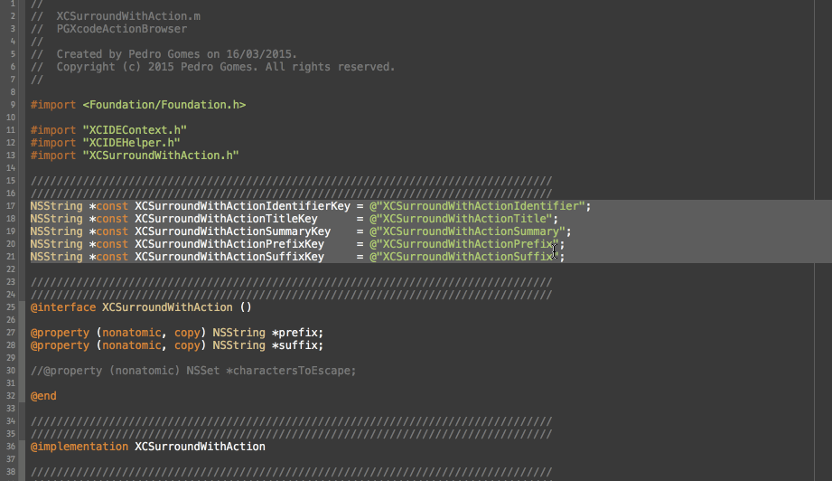
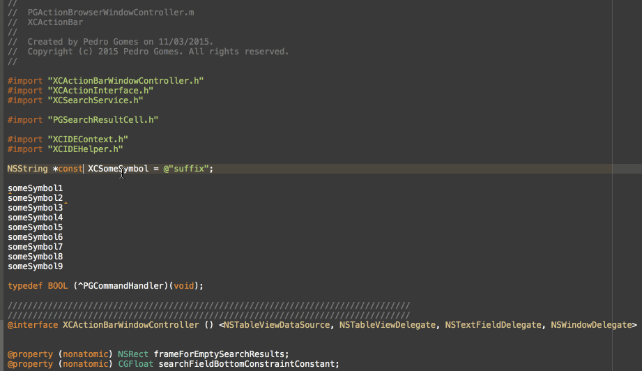
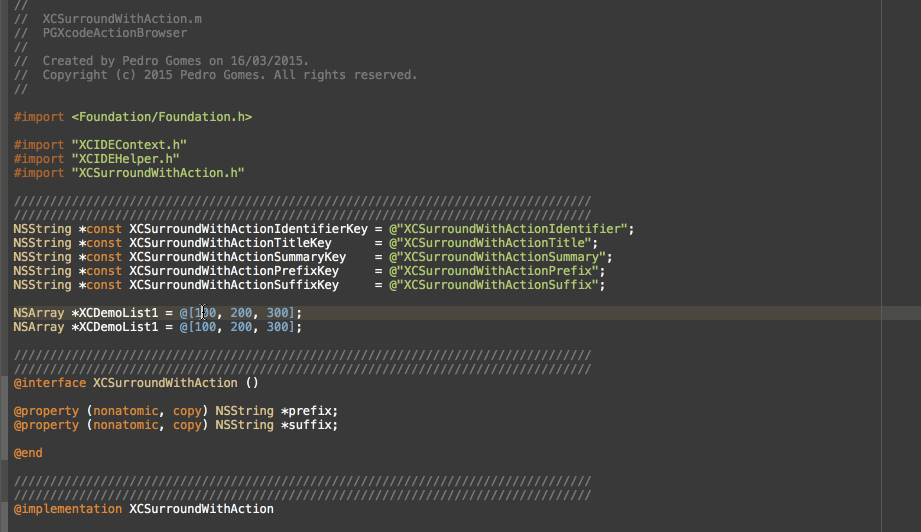
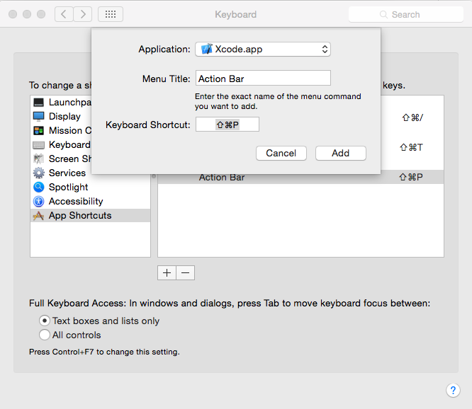

## XCActionBar -Xcode plugin

### *tl;dr*
**If** you use [Alfred](http://alfredapp.com), [LaunchBar](http://www.obdev.at/products/launchbar/index.html), [QuickSilver](http://qsapp.com/) or other similar products (and if you don't, you really should!), then you already know what this is all about.

**Else, if** you haven't and you are at least familiar with "Open Quickly" (default CMD+Shift+O), then you also know what this is all about -- it's like "Open Quickly" but for all menu bar actions, code snippets, unit tests, custom built-in actions that can operate on text or any other kind of custom action you'd like (just as long as you implement it)

**Else** Read along ... :)

###Updates:
If you'd like to keep up to date with the latest feature additions, keep an eye on the [changelog page](https://github.com/pdcgomes/XCActionBar/wiki/Changelog).

###Demo:

For more demos, please check out this [page](https://github.com/pdcgomes/XCActionBar/wiki/Demos), we'll be updating it over time.

Sorting lines demo:


Built-in __Add Prefix to Line(s)__ and __Add Suffix to Line(s)__ demo:


Built-in __Surround With NSNumber Literal__ and __Surround With NSString Literal__ demo:


###Motivation:

I always try to accomplish as much as I possibly can without ever moving my hands away from the keyboard, there's simply no other means of input that feels quite as natural or efficient.
Shortcuts are great, but there's only so many combinations of keys the average person can memorize. On top of that, the more shortcuts you have, the more likely you are to have to rely on multiple modifier key combinations, which may not always make them very comfortable to type.

It's much simpler and natural to type commands that actually describe what you want to achieve. I'm sure most people will agree that it's quicker to type `fold` or `unfold`than it is to type a four-key shortcut (which is basically as long as typing `fold`and probably doesn't feel as natural).

Note: This is preliminary documentation as this is very much work in progress.

###What can it do?

Here's the executive summary in three simple examples:

Example #1: Built in actions

1. Place the carret on the line you'd like to move up
2. Double tap `CMD` or press `CMD+SHIFT+8`
3. Type `m l u`
4. Return
5. Double tap `ALT` or press `CMD+ALT+7` to repeat the last action as many times as you'd like (this works for any action)

Example #2: Custom actions

1. Select a block of text
2. Double tap `CMD` or press `CMD+SHIFT+8`
3. Type `nsl`
4. Return

Notice as the selected block of text is automatically surrounded with `NSLog(@"your text selection")`
Hint: type `surround` for a list of available "Surround Text With" actions

Example #3: Code snippets

1. Place the carret where you'd like to expand the snippet
2. Double tap `CMD` or press `CMD+SHIFT+8`
3. Type `inline`
4. Select `C inline block as variable`
5. [fuckingblocksyntax.com](fuckingblocksyntax.com) suddenly becomes less necessary

Hopefully these short examples showcase some of the features **XCActionBar** currently supports. 
I'll continue adding features and making things generally better, so expect lots of changes in the coming weeks. 

### Searching

Action search currently operates on a few data sets:

* Menu Bar items and sub-items (recursively) 
* Code snippet library (system and user-defined)
* Custom plugin vended actions

The current searching strategy is very simple and naive but does the job quite effectively. While it doesn't yet support fuzzy matching, it's quite flexible in how it handles partial matches. Take a look at the examples above for a few examples. I'll be working on improving this very soon, but at this stage it does seem to be quite effective.

To bring up the action bar, type in the default shortcut `CMD+SHIFT+8` and enter your search terms. After performing an action, you can repeat it by typing in the repeat command shortcut `CMD+ALT+7`.

**UPDATED**:
* You can now present/dismiss the acion bar by simply double pressing `CMD` quickly
* You can now repeat the last executed action by simply double pressing `ALT`

The original shortcuts still work. I've also added a general configuration file `XCSurroundWithActions` which can be used to tweak these two shortcuts -- currently it only supports the following:

```
NSAlternateKeyMask
NSCommandKeyMask
NSControlKeyMask
NSFunctionKeyMask
NSShiftKeyMask    
```

This is all very much experimental so do expect changes.

### Actions

As mentioned above, the plugin comes bundled with a few custom actions. Following is a catalog of all of them and a short summary of what they do:

* `XCAddPrefixToLinesAction` **prepends** the string contents of the pasteboard to each selected line
* `XCAddSuffixToLinesAction` **appends** the string contents of the pasteboard to each selected line
* `XCCopyActiveDocumentFilePathAction` *copies* the active file path to the pasteboard. Supports `file://`, `POSIX` and `POSIX escaped` (useful for copying to the terminal)
* `XCCopyActiveDocumentDirectoryAction` *copies* the active file directory to the pasteboard. Supports `file://`, `POSIX` and `POSIX escaped` (useful for copying to the terminal)
* `XCDeleteBlankLinesAction` **deletes** all empty strings in the selected range
* `XCDeleteLineAction` deletes the line the carret is currently positioned in
* `XCDuplicateLineAction` duplicates the line the carret is currently positioned in, or the selected lines
* `XCSortSelectionAction` performs line sorting (ascending or descending) of the selected lines
* `XCSurroundWithAction` surrounds the selected text block with an arbitrary prefix/suffix
* `XCSurroundLineWithAction` surrounds each selected line with an arbitrary prefix/suffix
* `XCTrimWhitespaceAction` trims whitespace for each selected line (supports leading; trailing or both)

* `XCOpenActiveDocumentPathInTerminalAction` opens the active document's directory in the terminal app (currently supports `iTerm.app` and `Terminal.app` but more can be added in `XCActionBarConfiguration.plist` under `XCSupportedTerminalApplications`

#### Text selection actions
There are also a few actions that deal with text selections:

* `XCSaveTextSelection`
* `XCLoadTextSelection`
* `XCClearTextSelection`
* `XCMoveSelectionHere`

These allow you to select non-contiguous text selections using only your keyboard by selecting a chunk of text (as you would), but with the difference that you can then `save` the selection -- this will mark the text in orange (color will be customizable soon), you can then proceed and make additional selections. When you're done, just `load selection` which will cause the marked text to be fully selected. You can then apply any text action as you would for normal selections.
Two more things: at the time of writing, the marked text will not automatically _unmark_ itself, so you need to `clear selection`. Also, you can undo marking/unmarking of the text, which is pretty cool.

`XCMoveSelectionHere` allows you to quickly collect chunks of text and then move them to one place in one swift action - no more clunky mouse selections or multiple {cut, copy}/paste trips.

#### Surround With actions

I've bundled a few `XCSurroundLineWithAction` and `XCSurroundWithAction`S:

* Autorelease pool `@autoreleasepool { ... }`
* Square Brackets `[ ... ]`
* Curly Braces `{ ... }`
* Inline Block `void (^BlockVariable)(void) = ^{ ... }`
* NSLog `NSLog(@" ... ")`
* NSNumber `@( ... )`
* NSString `@" ... "`
* NSStringWithFormat `[NSString stringWithFormat:...]`
* Parenthesis `( ... )`
* Audit Non-null region `NS_ASSUME_NONNULL_BEGIN ... NS_ASSUME_NONNULL_END`
* Pragma diagnostic region
* Double Quotes `" ... "`
* Single Quotes `' ... '`
* Try/Catch `@try{ ...} catch(NSException *exception) {}`
* While `While(expression) { ... }`
* Do/While `do { ... } while(expression)`

There's also a very __meta__ action called `XCSurroundWithSnippetAction` that surrounds the selected block of the with a snippet from the library. There are some caveats though: 
* the snippet will only show up on the list if it contains at least one `<# Token #>` (otherwise we wouldn't know what would be the prefix/suffix)
* the **first** `<# Token #>` is replaced by the selected block of text

Similarly, you use `XCSurroundWithTextSnippetAction` to perform the same action as above, with the difference that it uses a text snippet from the pasteboard, meaning you can do ad-hoc surround operations without having to create a new snippet. You can also apply the substitution per-selected line by using `XCSurroundLineWithTextSnippetAction`.

Just type `surr` in the action bar to get a list of all available actions.

Note: currently none of these perform any character escaping
Some of the don't really make much sense when applied to **each line** so I might strip some out in the future

Also, some actions support optional user-defined input, which can come in handy. For example, lets say you specify the `XCDuplicateLineAction` but you actually want to duplicate it __ten__ times. You can hit `tab` with the `XCDuplicateLineAction` highlighted, and the input text field will change and ask you for the number of times you'd like to repeat the action. Just enter the number and hit `enter` - boom!

Currently the following actions support optional user input:

* `XCDuplicateLineAction`
* `XCAddPrefixToLinesAction`
* `XCAddSuffixToLinesAction`
* `XCAddPrefixToTextAction`
* `XCAddSuffixToTextAction`

There's currently no visual hint to let you know if an action supports arguments or not but I intend to add this feature in the near future.

Continue reading for more details on how to add your own custom actions.

### Smarter Code Snippets

Code snippets are great to save time, and while `<# tokens #>` already provide a great deal of flexibility, sometimes you just want to be able to dynamically expand some known token or even move the cursor to a specific location. This isn't new, and other apps such as TextExpander and Dash (and maybe others) do this already. In case you don't use any of those or you simply want to be able to have this capability built directly into Xcode, look no further!

When defining a text snippet you can use the following macros:

* `@author` automatically replaced by the current user's name
* `@clipboard` automatically replaced by the clipboard's text contents (if any)
* `@cursor` moves the cursor to this location after expanding the snippet
* `@date` replaced by the current date (format will be user configurable soon)
* `@time` replaced by the current time (format will be user configurable soon)
* others coming soon -- if you have suggestions, send them along!

__One caveat__: these expansions currently only work if you expand the snippets using XCActionBar. If you try to expand them via the default methods (either by just typing the snippet's name or by dragging it), they won't work. This will be probably be addressed in the future, but I don't think it's a big deal as most people would be expanding snippet via XCActionBar anyway.

### Extensibility

There are quite a lot of ideas floating around regarding extensibility, but for a first-pass implementation there's at least a little bit you can play with, in the form of `SurroundWith` actions. These are currently managed by an external property list file named `XCSurroundWithActions.plist` which can be found in the plugin's resource folder.
You're free to add your own entries or remove the stuff you don't need.

The format for each entry is a simple dictionary with the following keys:

* `XCSurroundWithActionIdentifier` a unique string identifier for the action
* `XCSurroundWithActionTitle` the action's title, displayed in the action bar
* `XCSurroundWithActionSummary` additional info that shows in the action bar's subtitle field
* `XCSurroundWithActionPrefix` the block of text that's prepended to the text you want to surround
* `XCSurroundWithActionSuffix` the block of text that's appended to the text you want to surround

If you're feeling more adventurous you can currently specify arbitrary actions by subclassing `XCCustomAction`. This is still very much in _flux_ in terms of design and is likely to change in the future, but the way this currently works is:

When you select an action from the search results list, ultimately the `- (BOOL)executeAction:(id<XCIDEContext>)context` action's method will be invoked. The `context` object provides some information about the current IDE state (active source code document, current text selection range, etc.) which is currently mostly useful for actions that need to manipulate text (pretty much all of them at the time of writing). This may change in the future.  

If you do choose to muck around and implement your own custom actions, the final step is to _register_ them. To do so, all you need to do is to add them to `XCActionBar.m` under `- (void)buildActionProviders`:

```objc
////////////////////////////////////////////////////////////////////////////////
// Built-in Actions
////////////////////////////////////////////////////////////////////////////////
NSMutableArray *textActions =
    @[
      // Duplicate/Delete Lines
      [[XCDeleteLineAction alloc] init],
      [[XCDuplicateLineAction alloc] init],
      
      // Sort Selection
      [[XCSortSelectionAction alloc] initWithSortOrder:NSOrderedAscending],
      [[XCSortSelectionAction alloc] initWithSortOrder:NSOrderedDescending],
      
      // Sort Contents
      [[XCSortContentsAction alloc] initWithSortOrder:NSOrderedAscending],
      [[XCSortContentsAction alloc] initWithSortOrder:NSOrderedDescending],
      
      // Add your custom action here
      ];
```

These actions don't yet show up in the menu bar, but they will get automatically indexed by the plugin. Soon you'll be able to manage custom actions and their groupings via an external property list file which will also be used to derive action groups under the menu bar, so stay tuned.

### Setup - Using custom shortcuts

The default hotkey to bring up Action Bar is `CMD+SHIFT+8`.
You can change this hotkey via the _Keyboard Shortcuts_ Panel in the System Preferences.

* Open System Preferences
* Go to `Keyboard`
* Switch to the `Shortcuts` tab
* Select `App Shortcuts` and click the `+` Button. 
    * Select `Xcode.app`
    * Enter `Action Bar` as Menu Title
    * Enter the Shortcut you want



Alternatively you can use (my preferred) shortcuts:
* Double press the `CMD` key to present/dismiss the bar
* Double press the `ALT` key to repeat the last action

These can also be customized but required a slightly more involved (but simple) process:
* Find and open the file [`XCActionBarConfiguration.plist`](../blob/master/PGXcodeActionBrowser/Plugin/XCActionBarConfiguration.plist)`XCActionBarConfiguration.plist` under the plugin installation folder (`Library/Application Support/Developer/Shared/Xcode/Plug-ins/XCActionBar.xcplugin/Contents/Resources`)
* Under the `Shortcuts` key you'll find `XCActionBarHotKey` and `XCRepeatLastActionHotKey`
* Tweak the values to your preferences

Here's a quick explanation of the configuration keys:

* `XCHotKeyListenerHotKeyMask` specifies the modifier key mask. Possible values are (declared in `NSEvent.h`):
    * `NSAlternateKeyMask`
    * `NSCommandKeyMask`
    * `NSControlKeyMask`
    * `NSFunctionKeyMask`
    * `NSShiftKeyMask`

Just use the enum's value (for example `NSCommandKeyMask = 1 << 20`, so you'd use `1048576`)
Please note that while these are bitmasks, **XCActionBar** currently only supports the definition of **one** key, so attempting to setup something like `NSAlternateKeyMask | NSCommandKeyMask` **won't work**.

* `XCHotKeyListenerRepeatCount` specifies the number of required key presses (currently only supports `2` or `3`)
* `XCHotKeyListenerRepeatDelay` specifies the maximum delay that can occur between the keypresses for the shortcut to trigger - tweak this if you feel the defaults are too sensitive for you


Feedback is greatly appreciated -- love it? hate it? suggestions? I'd love to hear about it!

Cheers,
Pedro.
